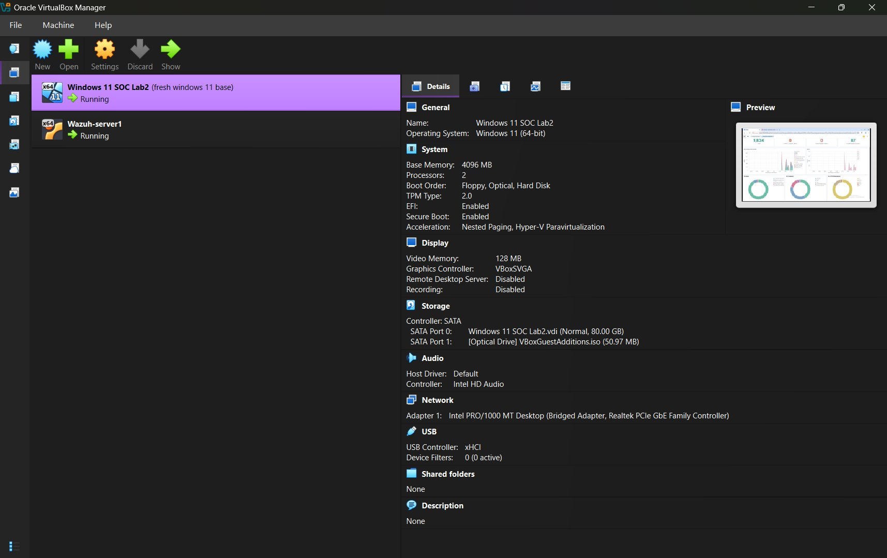
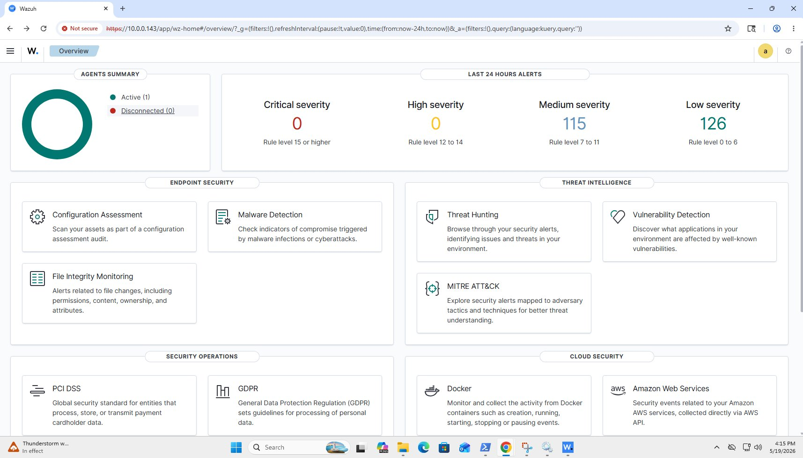
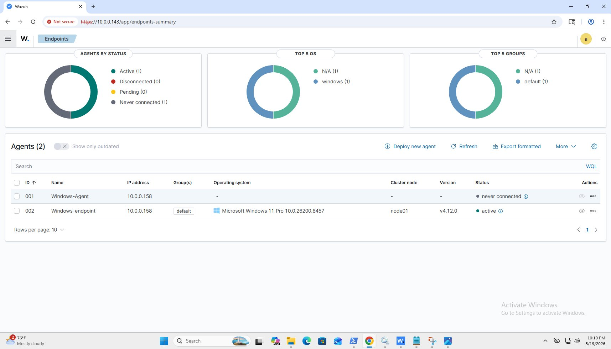
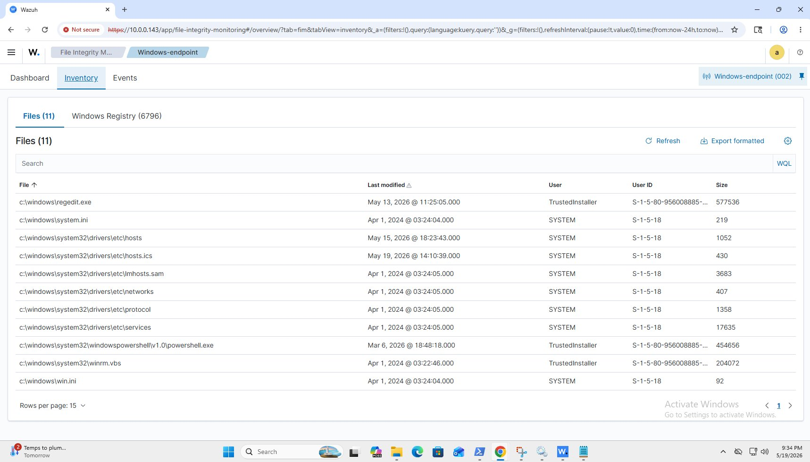
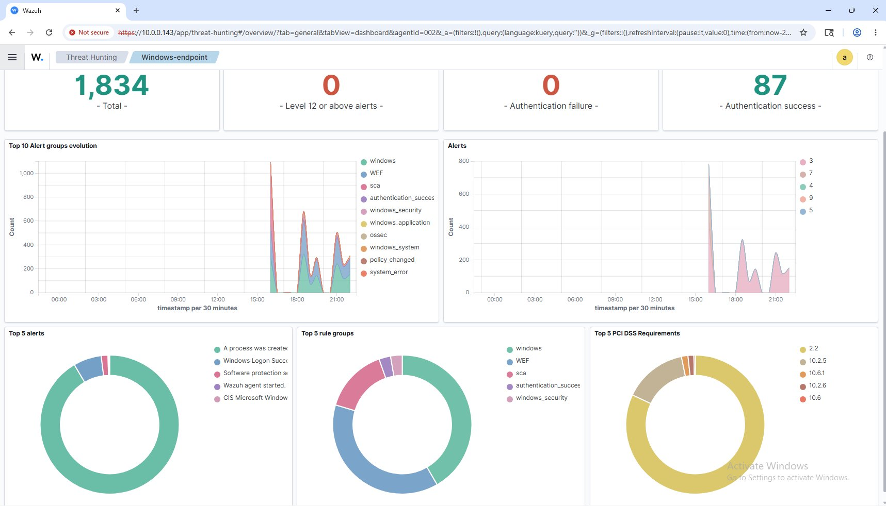
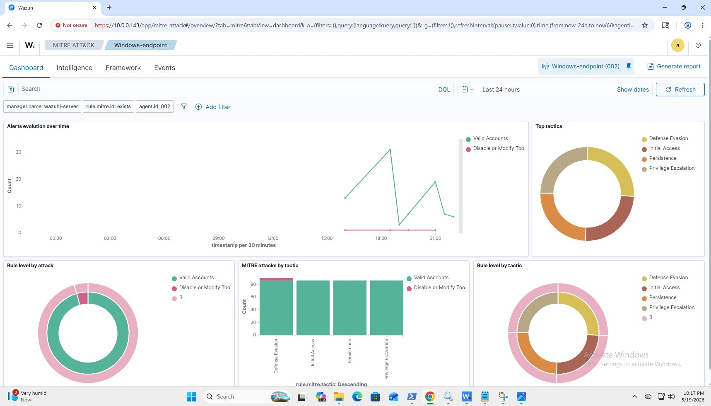
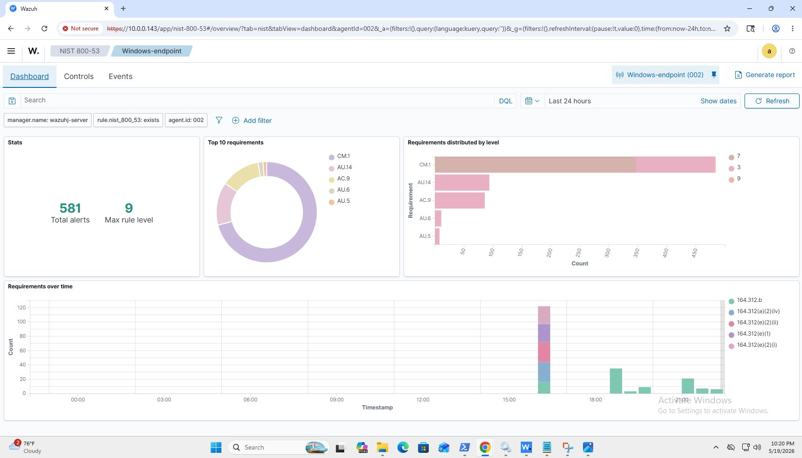
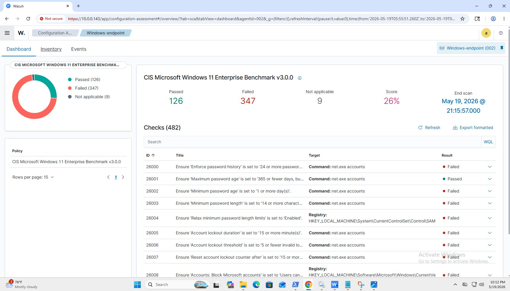

# Wazuh SIEM Home Lab

I built this lab to get hands-on experience with a real SIEM platform that's similar professional SOC environments. The goal was to deploy Wazuh from scratch, connect a live Windows endpoint, configure real-time security monitoring, and prove the entire pipeline works end to end.

**Project Goals:**
- Deploy a fully functional SIEM using Wazuh
- Connect a Windows machine as a monitored endpoint
- Configure File Integrity Monitoring to detect file changes in real time
- Generate and analyze real security alerts
- Document the entire process as a portfolio project

---

## Lab Structure

| Machine | Role | OS | IP Address |
|---|---|---|---|
| Wazuh-Server1 | SIEM Manager + Dashboard | Ubuntu Server 22.04 LTS | 10.0.x.x |
| Windows 11 SOC Lab2 | Monitored Endpoint | Windows 11 Pro | 10.0.x.x |

**What I downloaded to get started:**
- Oracle VirtualBox — to host both virtual machines
- Ubuntu Server 22.04 LTS ISO — for the Wazuh server
- Wazuh Agent MSI — for the Windows endpoint

---

## Setting Up the Virtual Machines

Both machines were created inside Oracle VirtualBox on the same physical host.

**Ubuntu Server VM:**
- RAM: 6GB
- Storage: 50GB
- Network: Bridged Adapter
- OS: Ubuntu Server 22.04 LTS

**Windows VM:**
- RAM: 4GB
- Storage: 80GB
- Network: Bridged Adapter
- OS: Windows 11 Pro

**Why Bridged Adapter matters:**

By default VirtualBox assigns VMs a NAT network which isolates them from the rest of the local network. When I first booted Ubuntu the VM received a NAT address that my Windows machine had no way of reaching. Switching both VMs to Bridged Adapter gave each machine a real IP on my local network allowing them to communicate directly. Without this the Windows agent would have no way of sending logs to the Wazuh server.



---

## Installing Wazuh on Ubuntu

Once Ubuntu was running I used the official Wazuh all-in-one installer which deployed the Manager, Indexer, and Dashboard automatically in a single command:

```bash
curl -sO https://packages.wazuh.com/4.12/wazuh-install.sh && sudo bash wazuh-install.sh -a -i
```

**What this installs:**
- **Wazuh Manager** — receives and analyzes all agent data
- **Wazuh Indexer** — stores and indexes all security events
- **Wazuh Dashboard** — the web interface for viewing alerts and data

After installation the dashboard was accessible through a browser at the Ubuntu server's local IP address.

---

## About the "Not Secure" Warning

When opening the Wazuh dashboard you will see a browser warning that says **"Not Secure"**. This is expected and does not mean the lab is broken or compromised.

Wazuh uses a **self-signed SSL certificate** by default. This means the HTTPS encryption is fully working but the certificate was not issued by a trusted Certificate Authority — it was generated locally during installation. Browsers flag self-signed certificates as untrusted even though the connection itself is encrypted. In a production SOC environment this would be replaced with a proper CA-signed certificate tied to a domain name.



---

## Connecting the Windows Endpoint

With Wazuh running on Ubuntu the next step was connecting the Windows machine as a monitored endpoint.

**Steps I followed:**
- Downloaded and installed the Wazuh Agent MSI on the Windows machine
- Opened the agent configuration file at `C:\Program Files (x86)\ossec-agent\ossec.conf`
- Set the manager IP address to the Ubuntu server's local IP
- Registered the agent to the manager through the Ubuntu terminal
- Restarted the WazuhSvc service on Windows

After registration the Windows machine appeared as an active agent inside the dashboard confirming that logs were flowing from the endpoint to the SIEM.



---

## File Integrity Monitoring

I configured Wazuh to monitor a dedicated folder on the Windows machine in real time by adding a directory entry to the agent config file:

```xml
<directories realtime="yes">C:\FIM-Test</directories>
```

Any file created, modified, renamed, or deleted inside that folder immediately generates an alert on the SIEM. The dashboard shows the file name, timestamp, user, and file size for every change detected. This is used to detect unauthorized file access, malware dropping files, or insider threats tampering with critical directories.



---

## Security Features in Action

Once the endpoint was connected Wazuh immediately began collecting and analyzing data from the Windows machine.

**Threat Hunting**

Over 1,800 total security events were collected from the Windows endpoint during this lab session including process creation, logon events, and system activity — all visible in real time.



**MITRE ATT&CK Mapping**

Wazuh automatically mapped detected events to the MITRE ATT&CK framework — the industry standard for classifying attacker tactics and techniques. The top tactics detected were:

| Tactic | Description |
|---|---|
| Defense Evasion | Techniques used to avoid detection |
| Initial Access | Methods used to gain entry into a system |
| Persistence | Techniques to maintain access over time |
| Privilege Escalation | Gaining higher level system permissions |



**NIST 800-53 Compliance**

Wazuh mapped 581 security alerts against NIST 800-53 — a federal security control framework used across government and enterprise environments. The highest alert volume fell under Configuration Management and Audit Review controls.



**CIS Benchmark Configuration Assessment**

Wazuh ran an automated CIS Microsoft Windows 11 Enterprise Benchmark v3.0.0 assessment against the endpoint:

| Result | Count |
|---|---|
| Passed | 126 |
| Failed | 347 |
| Not Applicable | 9 |
| Security Score | 26% |

A 26% score is completely normal for a default Windows 11 installation with no hardening applied. In a real SOC environment these failed checks would be escalated and remediated to bring the score up to an acceptable baseline.



---

## How to Replicate This Lab

If you want to build this yourself here is everything you need:

- Download Oracle VirtualBox at virtualbox.org
- Download Ubuntu Server 22.04 LTS ISO at ubuntu.com
- Create a VM with at least 6GB RAM and 50GB storage
- Set the network adapter to Bridged mode before installing Ubuntu
- Run the Wazuh all-in-one installer after Ubuntu is up
- Download the Wazuh Agent MSI on your Windows machine
- Point the agent at your Ubuntu server IP and register it
- Add a monitored directory to the agent config and restart the service

The most important thing to get right from the start is network configuration. Make sure both machines are on Bridged networking before anything else or the agent will never reach the server.
